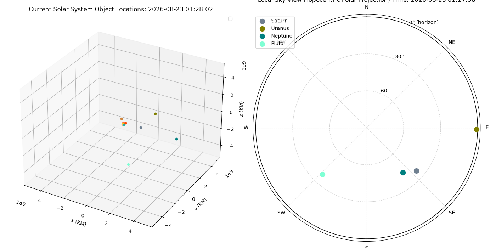

# Planet Spotter
Planet Spotter is a simple program that pulls planet data from NASA JPL's Horizons API and creates a short term simulation based on initial values. The goal is to create a program that allows users to see current planet locations relative to their current location on earth, as well as one of my first endeavors to become more familiar with Python programming!

## Method
### Step 1: Horizons API
> horizons_api.py

> horizons_parse.py

Real-time information is fetched from NASA JPL Horizons API for all planets in the solar system as well as the Sun and Pluto. 

- Hopefully moons will be added in the future

The received output is parsed to take only each object's GM (km^3/s^2) and ephemeris data (x, y, z, vx, vy, vz).

### Step 2: Initial Plotting
> planet_data.py
> planet_calc.py

The parsed data is plotted on a 3d graph with Matplotlib.pyplot. 

### Step 3: Physics Simulation
> planet_calc.py

Using the Semi-Implicit Euler method, the locations of the planets are calculated and updated on the graph. 

### Step 4: Translating to Local Perspectives
Fetching location information from APIs:

Fetch IP-address: (ipify)[https://www.ipify.org/]

Fetch rough geographical location: (ip-api.com)[https://ip-api.com/]

Convert to topocentric view with the earth in the middle, then convert to spherical coordinates. Use hour angle, local sidereal time, ra, and declination (radians) to find altitude and azimuth.

**Equations:**

r = sqrt(x**2 + y**2 + z**2)
  - distance

dec = arcsin(z/r)
  - declination

asc = atan2(y, x)
  - right ascension

LST = 100.46 + 0.985547 * d + longitude + 15 * UT
  - local sidereal time

H = LST - asc
  - hour angle

altitude (a) = arcsin(sin(dec)sin(lat) + cos(dec)cos(lat)cos(H))
  - altitude

azimuth (A) = arccos((sin(dec)-sin(a)sin(lat))/cos(a)cos(lat))
  - azimuth

### Step 5: Plotting
Using matplotlib.pyplot, plot two sub-plots: cartesian interactable graph (live updating) and polar local sky projection. 

<iframe src="/Planet-Spotter/solar_system_graph.html" width="100%" height="600px" style="border:none;"></iframe>
Shot taken on Aug 23, 2026 at 1:15 AM

### Next Steps: 
Continue converting to spherical and find a way to map visible stars relative to geographic observer coordinates!!

## Resources
### APIs Used:
* (NASA JPL Horizons API)[https://ssd.jpl.nasa.gov/horizons/]
* (ipify)[https://www.ipify.org/]
* (ip-api.com)[https://ip-api.com/]

### Libraries Used:
* numpy
* matplotlib.pyplot
* plotly (web visualization)
* requests
* astropy
* urllib.parse
* sys
* json
* datetime
* Typing

### References:
* ("5 steps to N-body simulation" by alvinng4)[https://alvinng4.github.io/grav_sim/5_steps_to_n_body_simulation/]
